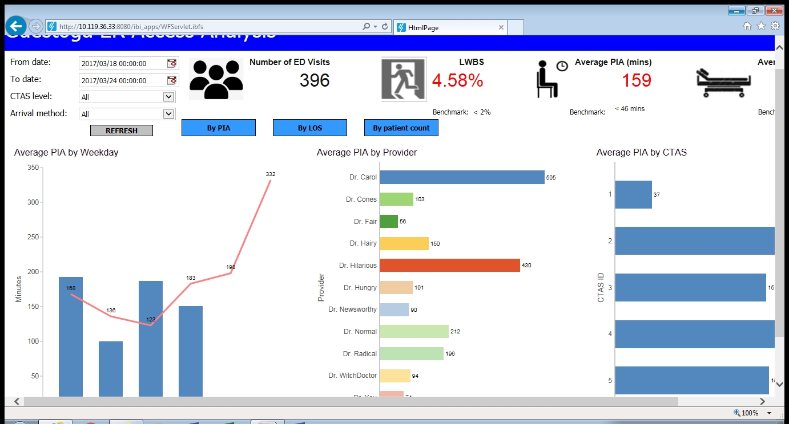

<H1>GUESTOGA Dashboard- Access Volumes</H1>
This is a dashboard based on high quality data of visits of a fictional GUESTOGA hospital. For this project we picked a theme of patient access and use on an operational level. Wherein we display weekly data for access to care showing the average PIA, length of stay, total patients, wait times and LWBS numbers.
This dashboard has options of filtering by date, CTAS level, and arrival method, which affects all six main information sections, including the three large at-a-glance numbers, and the three main graphs breaking down times by week, by physician, and by CTAS level. We chose to break down the data in this format for optimized use for staff, i.e. by having average PIA’s, LOS, and patient counts of the previous week show(red line) in comparison to current week, management can utilize the data visual as an anticipatory or predictive tool for patient volumes for staffing purposes. 

For this project, I coded the SQL files to display the data in the first weekly chart, for average PIA, LOS, patient counts, as well as the large PIA overall average number. These files were then fed and manipulated in Appstudio, till the graphs seen above could automatically be generated based on user inputs. 
<H2>Disclaimer</H2>  
All data used here is fake. There has been no real personal information used in the creation and population of fields in this dashboard.
